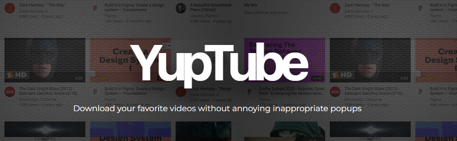

<p align="center">
  
</p>
<h1 align="center">
  YupTube - v1
</h1>
<p align="center">
  Ad-free YouTube Converter built with Node.js and express.
</p>




##### I've had enough of the ads and popups whenever I try to download a Youtube video, so I decided to make my own.

## 🛠 Setup the Project

1. Install the dependencies

   ```sh
   npm install or yarn
   ```
   
2. Start the development server

   ```sh
   npm test or node /bin/www
   ```
   
## 📄 Todos

- [ ] Download videos from playlists or channels
- [ ] Switch to Youtube-DL instead of free limited [Microlink API](https://microlink.io) plan
- [ ] Provide video quality and format selecting
- [ ] Download videos by search query
- [ ] Automatically embed subtitles
- [ ] Automatically download video instead of opening in browser
- [ ] Support other platforms (TikTok, Twitter, Instagram...)
